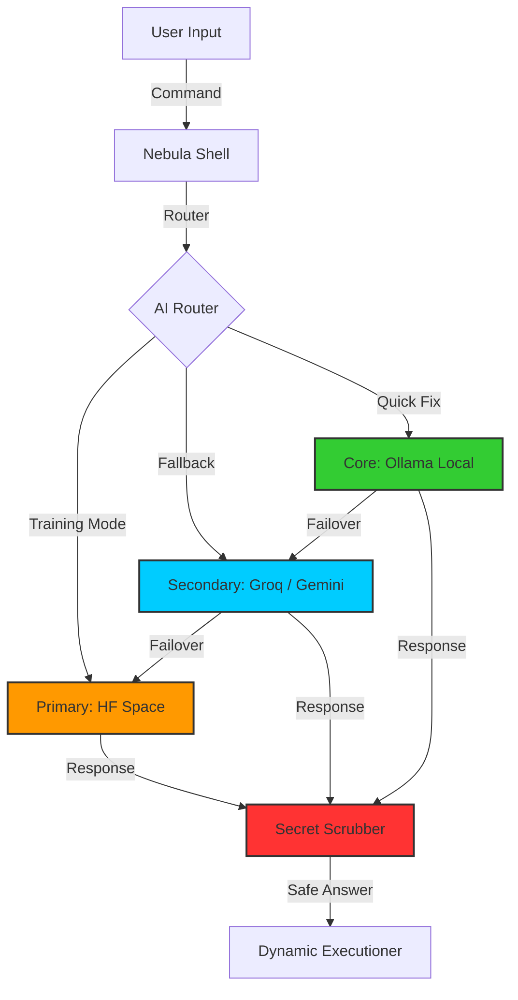

# Nebula-CLI: The Self-Healing Terminal Agent

## 🚀 Installation & Usage

[](https://github.com/sagar0163/nebula-cli/releases)
[](https://opensource.org/licenses/MIT)

### ⚡ Quick Start (30 seconds)

1. **Install:**
   ```bash
   # Using GitHub (recommended)
   npm install -g github:sagar0163/nebula-cli
   
   # Or clone and link
   git clone https://github.com/sagar0163/Nebula_cli.git
   cd Nebula_cli && npm link
   ```

2. **Configure (optional but recommended):**
   Get a free API key from [Google AI Studio](https://aistudio.google.com/app/apikey) and create a `.env` file:
   ```bash
   GEMINI_API_KEY=your_key_here
   ```

3. **Run:**
   ```bash
   nebula ask "hello world"
   ```

### Installation Methods

| Method | Command |
|--------|---------|
| GitHub (HTTPS) | `npm install -g github:sagar0163/nebula-cli` |
| Clone + Link | `git clone https://github.com/sagar0163/Nebula_cli.git && cd Nebula_cli && npm link` |
| From Source | `git clone`, `npm install`, `npm start` |

> [!TIP]
> **🛡️ Security Hardened (v5.4.0)**
> *   **Recursive AST Traversal**: 100% Block rate against Semantic Escapes.
> *   **Fail Closed**: Parser crashes now default to "Block".
> *   **Project Isolation**: Memory leakage between directories is physically impossible.


> [!CAUTION]
> **🚧 UNDER ACTIVE DEVELOPMENT 🚧**
> 
> This project is currently in an experimental **Alpha** state. You may encounter:
> *   Frequent crashes or unexpected behavior.
> *   Breaking changes between minor versions.
> *   Hallucinations in AI responses.
> 
> **Use with caution in production environments.**

## 📋 Prerequisites (For Developers)

If you are cloning this repository to build or contribute, ensure you have:

*   **Node.js**: v18.0.0 or higher (Required for ESM support).
*   **Git**: Latest version.
*   **Ollama**: (Optional) For running active local models.
*   **API Keys**: See Configuration section below for Cloud AI access.


> **"A terminal so smart, it fixes itself before you even notice."**

Nebula-CLI is a next-generation terminal agent powered by LLMs (Gemini/Ollama). It doesn't just run commands; it understands your intent, detects failures, and auto-corrects errors in real-time. Whether you're managing Kubernetes clusters or debugging a local Node.js app, Nebula is your silent partner in engineering.

## 🚀 Nebula v4.20 Architecture: Multi-Brain Failover

Nebula operates as a resilient, multi-tier intelligent layer between you and the OS kernel, designed for $0.00 cost, zero latency, and maximum privacy.

### 🏛️ The Three Tiers of Nebula
Your system functions like a spacecraft with redundant engines:

1.  **Primary (Sagar-Private-Space)**
    *   **The Brain**: Qwen 2.5 7B (iMatrix IQ4_XS) on Hugging Face CPU.
    *   **Role**: High-level Tyk architecture planning and complex Kubernetes debugging.
2.  **Secondary (Cloud Burst)**
    *   **The Brains**: Groq (Llama 70B) & Gemini 2.0.
    *   **Role**: Rapid failover if Hugging Face is "Cold Starting" or hitting rate limits.
3.  **Core (Local Fortress)**
    *   **The Brain**: Qwen 0.5B (Ollama).
    *   **Role**: The "Black Box" for basic shell commands. 100% functional offline.



### 🛡️ The "Fortress" Security Layer
Even with multiple cloud providers, the **Secret Masking** and **Command Validation** layers remain local, ensuring secrets are scrubbed *before* they touch any cloud API.

### 📈 Why This Architecture Matters
*   **Cost**: "Pro" grade system for **$0.00**.
*   **Latency**: "Pre-Warming" and "Local Fallback" ensures zero waiting.
*   **Privacy**: "Red Team" security layer masks secrets locally.

## ✨ Key Features

### 🌍 Universal Project Understanding
Nebula instantly recognizes what you are working on and adapts its behavior.
*   **Projects**: Helm, RPM, OpenShift, Docker, Terraform, Ansible, Node.js, Generic K8s.
*   **Environments**: Automatically detects **Minikube**, **EKS**, **GKE**, **OpenShift**, or **AKS**.
*   **Result**: It generates `aws eks update-kubeconfig` for EKS, but `minikube dashboard` for local dev.

### 🧠 "Memento" Project-Isolated Memory (New in v5.1)
Nebula now creates a unique "Memory Vault" for each directory you work in.
*   **Context Aware**: "fix it" knows *exactly* which error just happened in *this* specific project.
*   **Isolation**: Your React fixes won't confuse your Python scripts.
*   **Tiered Lookup**: 
    1.  **Session Cache** (0.1ms): Instant recall of recent fixes.
    2.  **Project Memory** (Local Vector DB): Persistent history for this specific folder.
    3.  **Global Wisdom**: Universal knowledge shared across all projects.

### 🛡️ Runtime Guards & Safety
*   **Look Before You Leap**: Automatically checks Kubernetes connectivity, namespace existence, and missing secrets *before* running deployment commands.
*   **Red-Line Warnings**: Highlights destructive commands (`rm -rf`, `kubectl delete`, `drop table`) in **RED** and demands confirmation.
*   **Safe Execution**: Never runs AI commands without your explicit "Yes".

### ⏱️ Dynamic Execution Engine
*   **Smart Timeouts**: Knows that `ls` takes 1s but `docker build` needs 10m.
*   **Live Feedback**: Real-time progress monitoring (`🔄 156KB | 🟢 Active`) instead of frozen screens.
*   **Hung Process Detection**: Warns you if a process stops generating output (`🟡 Stalled`).

## 📦 Installation

```bash
npm install -g nebula-cli
```

## 🔧 Configuration

Configure Nebula via `.env` file or environment variables:

| Variable | Description | Default |
| :--- | :--- | :--- |
| `GEMINI_API_KEY` | Google Gemini API Key (Required for Cloud AI) | - |
| `GEMINI_MODEL` | Gemini Model ID | `gemini-2.0-flash` |
| `GROQ_API_KEY` | Groq API Key (Alternative Cloud AI) | - |
| `OLLAMA_MODEL` | Local LLM Model Name | `llama3.2` |

## 🛠 Usage

### 1. Interactive Mode (Recommended)
Enter the persistent, self-healing shell:
```bash
nebula
```
*   **Ask Anything**: `ask "deploy this helm chart to tyk ns"`
*   **Auto-Healing**: If a command fails, Nebula analyzes the error and suggests a fix.
*   **Universal**: Switch from a Node.js project to a K8s cluster seamlessly.

### 2. DevOps Automation
```bash
# Detects project type and suggests next steps
nebula predict

# Analyzes complex failures
nebula ask "why is my pod crashlooping?"
```

## 🛡️ Safety & Privacy

### Human-in-the-Loop
Nebula is designed as a **copilot**, not an autopilot.
*   **Explicit Consent**: Nebula will NEVER execute an AI-suggested command without your explicit "y/N" confirmation.
*   **Review First**: Always read the suggested fix before hitting 'y'.

### Privacy Warning (Free Tier)
If you are using the free tier of Gemini or other public LLM providers:
*   **Data Usage**: Your command history and error logs may be processed by human reviewers to improve the model.
*   **Sensitive Data**: **DO NOT** use Nebula with secrets, API keys, or PII (Personally Identifiable Information) in the terminal output when using public models.

## ⚠️ Disclaimer

**Experimental Technology**: Nebula-CLI uses large language models which can be unpredictable.
*   **Hallucinations**: The AI may suggest commands that do not exist or do not solve the problem.
*   **Liability**: You are responsible for the commands executed on your machine. The authors of Nebula-CLI are not liable for any data loss or system damage.

## 🤝 Contributing

We follow **Conventional Commits** and strict CI/CD pipelines.

1.  Fork & Clone
2.  `npm install`
3.  `npm test`
4.  Submit a PR with `feat:` or `fix:` messages.

## 📄 License

MIT © 2025 Sagar
